<div align="center">

# 🏎️ Formula 1 Data Engineering Platform

### End-to-End Azure Databricks Data Lakehouse | PySpark · Delta Lake · Unity Catalog · Lakeflow Jobs

[](https://azure.microsoft.com/en-us/products/databricks)
[](https://spark.apache.org/)
[](https://delta.io/)
[](https://www.python.org/)
[](https://github.com/dipanshu69/Formula1)

</div>

---

## 📌 Project Overview

This project implements a **production-grade, end-to-end Data Engineering platform** built on **Azure Databricks**, using **Formula 1 Motor Racing data** as the analytical domain.

The platform ingests 6 raw F1 entity types (circuits, races, drivers, constructors, results, sprint results) from **Azure Data Lake Gen2**, processes them through a **3-layer Medallion Architecture (Bronze → Silver → Gold)**, and serves analytics through **Databricks SQL Dashboards** with live 2025 F1 season data.

The entire pipeline is orchestrated using **Databricks Lakeflow Jobs**, with all notebooks hosted on **GitHub** and referenced directly from Lakeflow tasks — enabling version-controlled, CI-ready, branch-based pipeline execution. Two independent pipelines are maintained:

| Pipeline | Branch | Catalog | Job |
|---|---|---|---|
| Full Refresh | `azure-prod` | `formula1` | `Formula_1_Full_Refresh` |
| Incremental Load | `Formula1_Incre` | `formula1_incr` | `Formula_1_Incremental_Loads` + `Formula1_Incremental_Batch_Orchestration` |

---

## 🏗️ Solution Architecture

```
┌─────────────────────────────────────────────────────────────────────────────┐
│                             GitHub Repository                               │
│        azure-prod branch (Full Refresh) │ Formula1_Incre (Incremental)      │
└──────────────────────────┬──────────────────────────────────────────────────┘
                           │  Linked via Databricks Git Folders
                           ▼
┌─────────────────────────────────────────────────────────────────────────────┐
│                        SOURCE LAYER                                         │
│         Azure Data Lake Gen2 — formula1-incr Container                      │
│    Folders: landing/ · bronze/ · silver/ · gold/ · __unitystorage/          │
└──────────────────────────┬──────────────────────────────────────────────────┘
                           │
            ┌──────────────┴──────────────┐
            │                             │
            ▼                             ▼
  ┌─────────────────────┐     ┌─────────────────────────┐
  │   FULL REFRESH      │     │   INCREMENTAL LOAD      │
  │   azure-prod branch │     │   Formula1_Incre branch │
  │   formula1 catalog  │     │   formula1_incr catalog │
  └──────────┬──────────┘     └────────────┬────────────┘
             │                             │
             ▼                             ▼
┌─────────────────────────────────────────────────────────────────────────────┐
│                       BRONZE LAYER (Raw Ingestion)                          │
│  PySpark · Explicit Schema · Metadata Tagging · Parameterised Notebooks     │
│  Entities: circuits · races · drivers · constructors · results · sprints    │
│  Delta Tables → Unity Catalog (bronze schema)                               │
└──────────────────────────┬──────────────────────────────────────────────────┘
                           │
                           ▼
┌─────────────────────────────────────────────────────────────────────────────┐
│                       SILVER LAYER (Cleansed & Standardised)                │
│  Column Standardisation · Data Quality Checks · Type Casting                │
│  Incremental: Delta MERGE (UPSERT) · Batch Control Table                    │
│  Delta Tables → Unity Catalog (silver schema)                               │
└──────────────────────────┬──────────────────────────────────────────────────┘
                           │
                           ▼
┌─────────────────────────────────────────────────────────────────────────────┐
│                        GOLD LAYER (Analytical)                              │
│  Dimensional Model: dim_races · dim_drivers · dim_constructors              │
│  Fact Table: fact_results                                                   │
│  Analytical Views: driver_standing · constructors_standing                  │
│  Reference: ref_nationality_region                                          │
└──────────────────────────┬──────────────────────────────────────────────────┘
                           │
                           ▼
┌─────────────────────────────────────────────────────────────────────────────┐
│                         SERVING LAYER                                       │
│   Databricks SQL Warehouse · 4 Interactive Dashboards · AI BI Genie         │
└─────────────────────────────────────────────────────────────────────────────┘

Orchestration : Lakeflow Jobs (GitHub-linked · Scheduled + Event-Based Triggers)
Governance    : Unity Catalog (Metastore · Access Connectors · External Locations)
Security      : Azure RBAC · Managed Identities · Storage Credentials
```

---

## 🛠️ Tech Stack

| Category | Technology |
|---|---|
| Cloud Platform | Microsoft Azure |
| Compute & Processing | Azure Databricks, Apache Spark (PySpark + Spark SQL) |
| Storage | Azure Data Lake Gen2 |
| Table Format | Delta Lake (ACID, Time Travel, MERGE/UPSERT) |
| Data Governance | Unity Catalog (Metastore, Access Connectors, External Locations) |
| Security | Azure RBAC, Managed Identity, Storage Credentials, Contributor Role |
| Orchestration | Databricks Lakeflow Jobs (Scheduled + Event-Based Triggers) |
| Analytics & BI | Databricks SQL, Dashboards, AI BI Genie |
| Version Control | GitHub (2-branch strategy, integrated with Lakeflow Jobs) |
| Language | Python (PySpark), SQL |
| Architecture Pattern | Medallion Architecture (Bronze → Silver → Gold) |

---

## 📁 Project Structure

### Databricks Workspace — GitHub Git Folder

```
Formula1/
├── 00-common/          # Shared utility functions and common config
├── 01-setup/           # Unity Catalog setup, storage credentials, external locations
├── 02-bronze/          # Raw ingestion notebooks (6 entities)
├── 03-silver/          # Cleansing and transformation notebooks
├── 04-Gold/            # Dimensional model and analytical views
├── 05-analytics/       # Driver/Constructor standings views, dominant analysis
└── README.md
```

### Branch Strategy

| Branch | Purpose | Lakeflow Job |
|---|---|---|
| `main` | Default / base branch | — |
| `azure-prod` | Full refresh pipeline | `Formula_1_Full_Refresh` |
| `Formula1_Incre` | Incremental load pipeline | `Formula_1_Incremental_Loads` + `Formula1_Incremental_Batch_Orchestration` |

### ADLS Gen2 — `formula1-incr` Container

```
formula1-incr/
├── landing/          # Raw source files (CSV, JSON)
├── bronze/           # Delta tables — raw ingested data
├── silver/           # Delta tables — cleansed data
├── gold/             # Delta tables — dimensional model
└── __unitystorage/   # Unity Catalog managed storage
```

> **Screenshot: ADLS Gen2 Container Structure & Databricks Workspace**

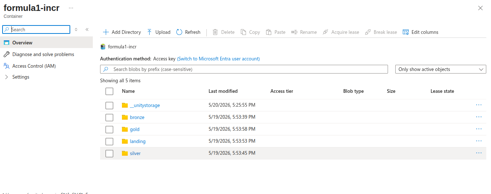
*Azure Data Lake Gen2 — formula1-incr container with Medallion layer folders*

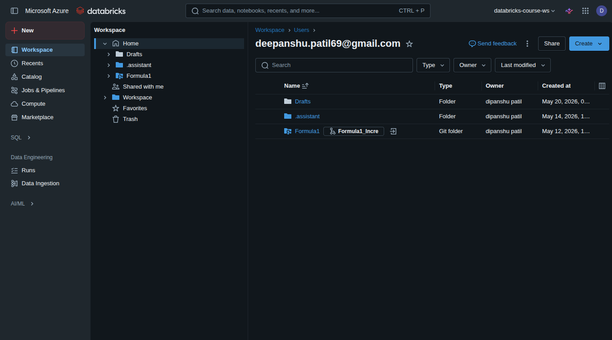
*Databricks Workspace showing Formula1 as a GitHub-linked Git Folder with Formula1_Incre branch*

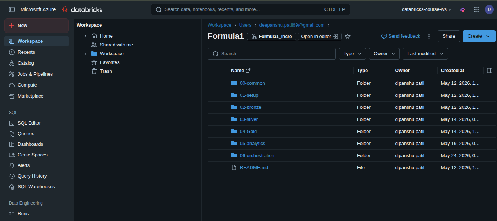
*Formula1 project folder structure on azure-prod branch — numbered layer organisation*

---

## 🔒 Security & Governance Setup

### Unity Catalog — Access Configuration

A key part of this project is the **secure, identity-based access** to ADLS Gen2, implemented via:

- **Access Connector** — Managed Identity resource created in Azure, assigned the **Contributor Role** on the ADLS Gen2 storage account
- **Storage Credential** — Registered in Databricks using the Access Connector's managed identity
- **External Location** — Configured in Databricks, pointing to the ADLS Gen2 container path using the storage credential
- **Managed Location** — Used for Unity Catalog-managed Delta tables
- **Unity Catalog Metastore** — Linked to the Databricks workspace; all data assets governed through catalog → schema → table hierarchy

This setup eliminates the need for access keys or service principal secrets — all authentication is handled via **managed identity and Azure RBAC**.

### Unity Catalog — Object Model

> **Screenshot: Unity Catalog — Catalogs, Schemas & Tables**

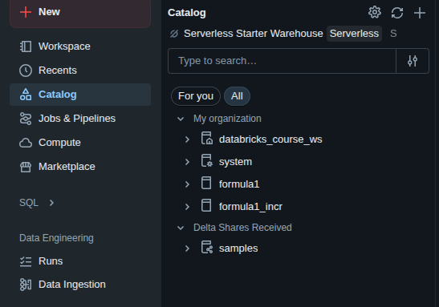
*Two independent Unity Catalog catalogs — formula1 (full refresh) and formula1_incr (incremental)*

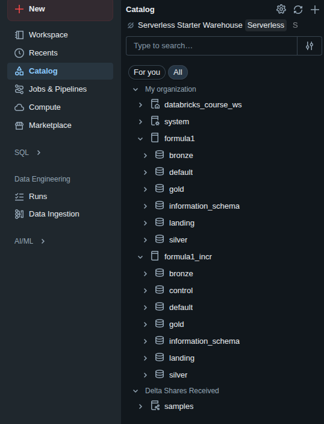
*Both catalogs expanded — formula1_incr includes a dedicated `control` schema for batch tracking*

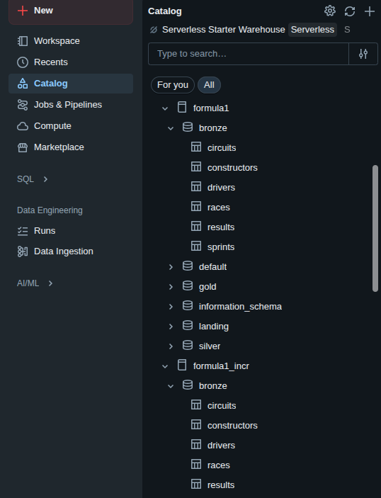
*Bronze schema tables — circuits, constructors, drivers, races, results, sprints registered as Delta tables*

---

## 🔄 Pipeline Workflow

### Pipeline 1 — Full Refresh (`azure-prod` branch → `formula1` catalog)

**Lakeflow Job: `Formula_1_Full_Refresh`**

The full refresh pipeline runs all 3 medallion layers in a single orchestrated job with parallel Bronze ingestion, sequential Silver transformation, and parallel Gold build.

**Task Execution Flow:**
```
[Parallel Bronze Ingestion]
01_Ingest_Circuits_File  ──┐
02_Ingest_Races_File      ──┤
03_Ingest_Constructors_File─┤──► [Silver Transforms] ──► [Gold Dimensions & Fact]
04_Ingest_Drivers_File    ──┤
05_Ingest_Results_File    ──┤
06_Ingest_Sprints_File    ──┘
                    91_Build_Nationality_Region (Reference)
```

---

### Pipeline 2 — Incremental Load (`Formula1_Incre` branch → `formula1_incr` catalog)

**Two Lakeflow Jobs working together:**

**Job 1: `Formula1_Incremental_Batch_Orchestration`** (Smart Conditional Orchestrator)
```
01_Identify_Next_Batch
        │
        ▼
Is_There_A_Batch_To_Process?
    │               │
   TRUE            FALSE
    │               │
    ▼               └──► (Stop — no new data)
02_Create_New_Batch
        │
        ▼
Job_Formula1_LakeHouse_Incremental_Refresh  ◄── Triggers Job 2
        │
        ▼
03_Complete_Batch
```

**Job 2: `Formula_1_Incremental_Loads`** (same DAG as full refresh but MERGE-based with `p_batch_id` parameter)

> **Screenshot: Lakeflow Jobs Overview & Pipeline DAGs**

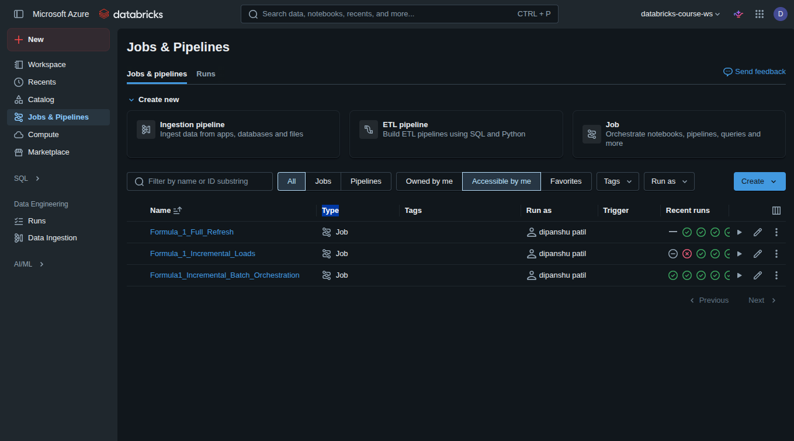
*Databricks Jobs & Pipelines — 3 Lakeflow Jobs with run history status*

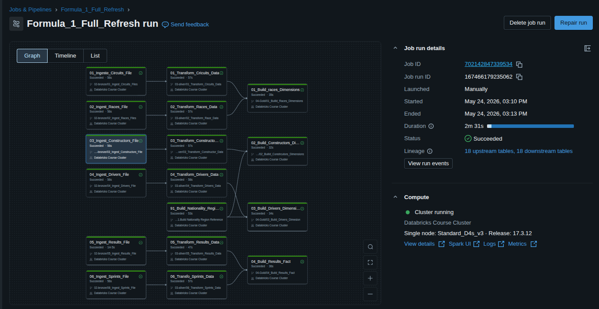
*Formula_1_Full_Refresh — Parallel ingestion → Transform → Gold build. Lineage: 18 upstream + 18 downstream tables*

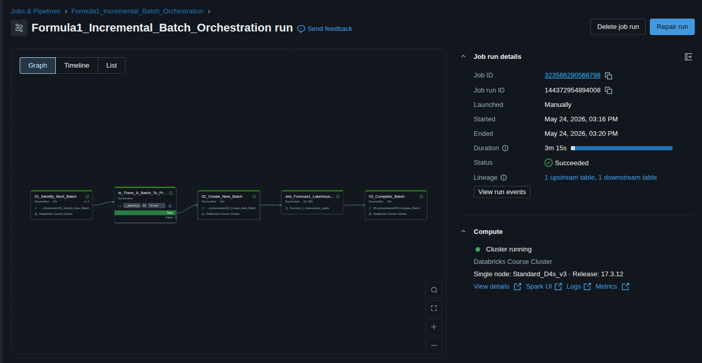
*Formula1_Incremental_Batch_Orchestration — Conditional logic checks for available batches before triggering the load job*

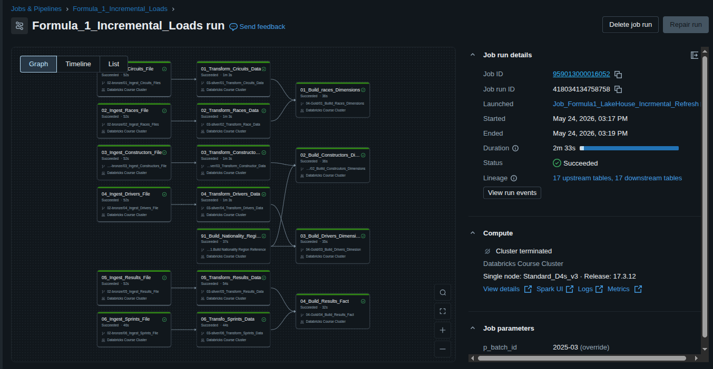
*Formula_1_Incremental_Loads — Succeeded in 2m 33s. Launched by orchestration job with p_batch_id: 2025-03*

---

## ⏰ Triggers

Both jobs support multiple trigger configurations:

| Trigger Type | Description |
|---|---|
| **Scheduled Trigger** | Runs at configured time intervals (e.g., daily/hourly) |
| **Event-Based Trigger (File Arrival)** | Fires when new data files land in the ADLS container |
| **Event-Based Trigger (Table Update)** | Fires when an upstream Delta table is updated |
| **Manual / Orchestration-Triggered** | `Formula_1_Incremental_Loads` triggered by `Formula1_Incremental_Batch_Orchestration` |

---

## 🔗 GitHub Integration with Lakeflow Jobs

> One of the most important architectural decisions in this project.

Instead of pointing Lakeflow task notebook paths to files stored in the **Databricks workspace**, all tasks reference notebooks directly from the **GitHub repository** via Databricks Git Folders.

**How it works:**
1. Databricks workspace is linked to the GitHub repo via **Git Folders (Repos)**
2. Each Lakeflow Job task points to a notebook path inside the linked Git Folder
3. The task specifies which **branch** to use (`azure-prod` for full refresh, `Formula1_Incre` for incremental)
4. Any `git push` to the branch is immediately picked up by the next job run

**Why this matters:**
- ✅ Full version control — every pipeline change is a Git commit
- ✅ Branch-based development — full refresh and incremental are independently versioned
- ✅ CI/CD ready — supports PR workflows, code reviews, and rollback via Git
- ✅ No notebook drift between workspace and source code
- ✅ Audit trail for all pipeline changes

---

## 📊 Gold Layer — Dimensional Model & SQL Views

### Gold Layer Tables (7 objects in `formula1.gold`)

| Object | Type | Description |
|---|---|---|
| `dim_races` | Dimension Table | Race details — season, round, circuit, date |
| `dim_drivers` | Dimension Table | Driver details — name, nationality, DOB |
| `dim_constructors` | Dimension Table | Constructor details — name, nationality |
| `fact_results` | Fact Table | Race results — points, position, is_win, is_podium |
| `driver_standing` | View | Ranked driver standings per season (CTE + window function) |
| `constructors_standing` | View | Ranked constructor standings per season |
| `ref_nationality_region` | Reference Table | Nationality to region mapping |

> **Screenshot: Gold Schema & SQL View Definition**

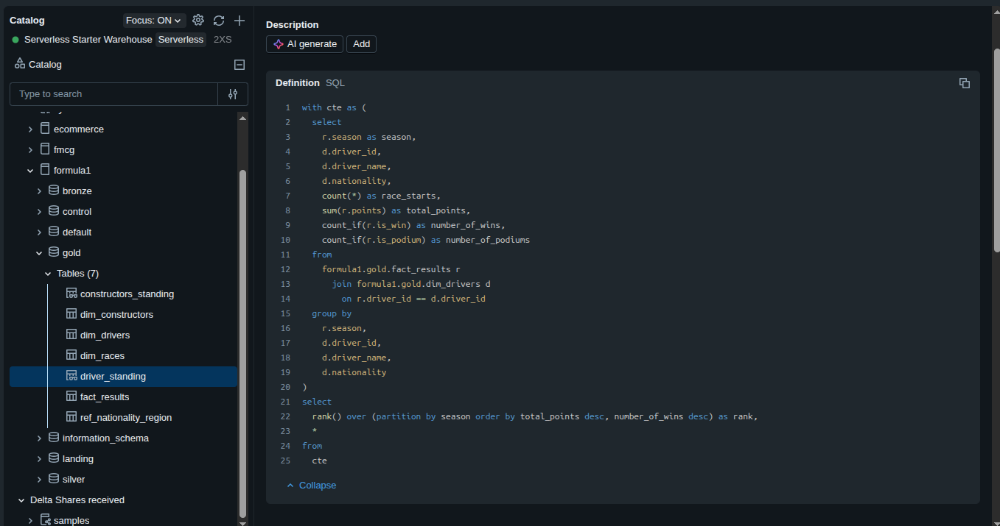
*Unity Catalog showing formula1.gold schema with 7 tables, and the driver_standing view SQL definition using CTE + RANK() window function*

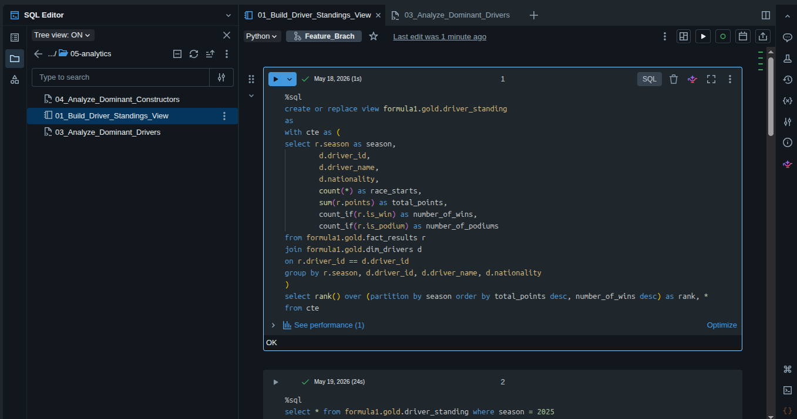
*Databricks notebook building the driver_standing view — CREATE OR REPLACE VIEW with CTE and Spark SQL window function*

---

## 📈 Analytics Dashboards

**Formula1 Analytics Dashboard** — built on Databricks SQL Warehouse, querying Gold layer Delta tables live.

### 4 Dashboard Tabs:
1. **Driver Championship Standings** — season filter, standings table, wins by driver donut chart, points bar chart
2. **Constructors Championship Standings** — team rankings, wins by team donut chart
3. **Dominant Drivers of All Time** — multi-season dominance analysis
4. **Dominant Teams of All Time** — historical team performance trends

> **Screenshot: Live 2025 F1 Season Dashboards**

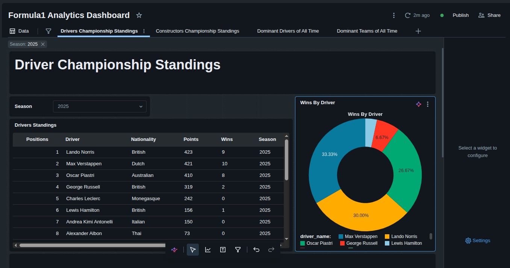
*Driver Championship Standings — 2025 Season. Lando Norris leads with 423 pts, followed by Max Verstappen (421) and Oscar Piastri (410)*

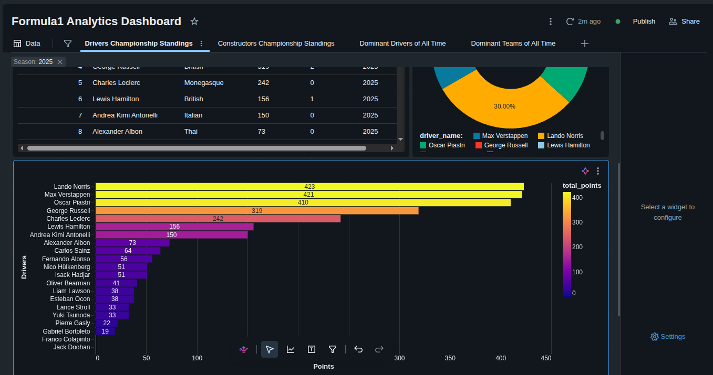
*Total points bar chart for all 2025 drivers — colour-gradient visualisation showing points distribution*

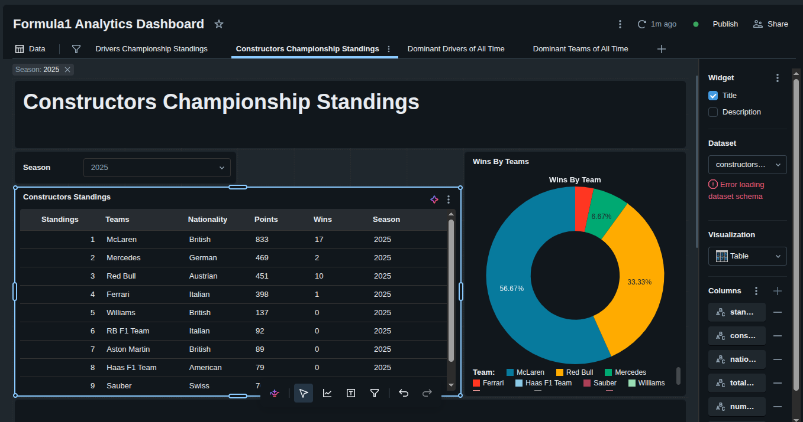
*Constructors Championship Standings — McLaren dominating 2025 with 833 pts and 17 wins*

---

## ⚙️ Setup Instructions

> Follow these steps to replicate this project in your own Azure environment.

### Prerequisites
- Azure subscription with Databricks workspace provisioned
- Azure Data Lake Gen2 storage account created
- GitHub account — fork this repository

### Step-by-Step

```bash
# Step 1 — Fork and clone the repository
git clone https://github.com/dipanshu69/Formula1.git
```

**Step 2 — Azure Security Setup (Access Connector)**
1. Create an **Azure Access Connector for Databricks** resource in Azure Portal
2. Assign **Contributor Role** on the ADLS Gen2 storage account to the Access Connector's managed identity
3. In Databricks → Catalog → External Data → **Credentials** → Add storage credential using the Access Connector

**Step 3 — External Location Setup**
1. In Databricks → Catalog → External Data → **External Locations**
2. Create external location pointing to `abfss://<container>@<storage>.dfs.core.windows.net/`
3. Associate with the storage credential created above

**Step 4 — Unity Catalog Setup**
```sql
-- Create catalogs
CREATE CATALOG IF NOT EXISTS formula1;
CREATE CATALOG IF NOT EXISTS formula1_incr;

-- Create schemas (repeat for both catalogs)
CREATE SCHEMA IF NOT EXISTS formula1.bronze;
CREATE SCHEMA IF NOT EXISTS formula1.silver;
CREATE SCHEMA IF NOT EXISTS formula1.gold;
CREATE SCHEMA IF NOT EXISTS formula1.landing;

-- Additional schema for incremental batch tracking
CREATE SCHEMA IF NOT EXISTS formula1_incr.control;
```

**Step 5 — Link GitHub Repository to Databricks**
1. Databricks Workspace → Repos → Add Repo
2. Enter: `https://github.com/dipanshu69/Formula1.git`
3. Switch to `azure-prod` branch for full refresh, `Formula1_Incre` for incremental

**Step 6 — Configure Lakeflow Jobs**
1. Create `Formula_1_Full_Refresh` job → point tasks to `azure-prod` branch notebooks
2. Create `Formula_1_Incremental_Loads` job → point tasks to `Formula1_Incre` branch notebooks
3. Create `Formula1_Incremental_Batch_Orchestration` job with conditional branching tasks
4. Configure triggers (scheduled / file arrival event)

**Step 7 — Run the Pipeline**
- For full refresh: manually trigger `Formula_1_Full_Refresh`
- For incremental: trigger `Formula1_Incremental_Batch_Orchestration` — it auto-detects and processes available batches

---

## 🧩 Challenges & Solutions

| Challenge | Solution |
|---|---|
| Hardcoded file paths breaking across environments | Parameterised all notebooks using Databricks widgets and job-level parameters (`p_batch_id`) |
| Repeated ingestion logic across 6 entity notebooks | Extracted shared utilities into `00-common` module |
| Full-load reprocessing wasting compute on unchanged data | Redesigned all 3 layers for incremental processing using Delta MERGE with a `control` schema batch table |
| Knowing whether new data is available before running | Built `Formula1_Incremental_Batch_Orchestration` with conditional True/False branching — only runs load job when a new batch exists |
| Notebook code not version-controlled (workspace only) | Linked Databricks workspace to GitHub; Lakeflow tasks reference GitHub branch notebooks directly |
| Managing full refresh vs incremental separately | Two-branch, two-catalog strategy — completely independent pipelines with shared architecture |
| Secure ADLS access without access keys | Implemented Access Connector with Contributor Role + Storage Credentials + External Locations in Unity Catalog |

---

## 📊 Key Metrics

| Metric | Value |
|---|---|
| Pipeline Layers | 3 (Bronze → Silver → Gold) |
| F1 Entity Types Processed | 6 (circuits, races, drivers, constructors, results, sprints) |
| Lakeflow Jobs | 3 |
| Gold Layer Objects | 7 (dim tables + fact table + views + reference) |
| Databricks SQL Dashboards | 4 tabs |
| Full Refresh Duration | ~2 minutes |
| Incremental Load Duration | ~2m 33s |
| Unity Catalog Catalogs | 2 (formula1 + formula1_incr) |
| GitHub Branches (Active) | 2 (azure-prod + Formula1_Incre) |
| Lineage (Full Refresh) | 18 upstream + 18 downstream tables |

---

## 👤 Author

**Dipanshu Patil**

MBA in Business Analytics & IT | Azure Databricks Data Engineer

- 🔗 [LinkedIn](https://linkedin.com/in/deepanshu-patil-b5a1b02a1)
- 💻 [GitHub](https://github.com/dipanshu69)

---

<div align="center">
⭐ If this project helped you, consider giving it a star!
</div>
